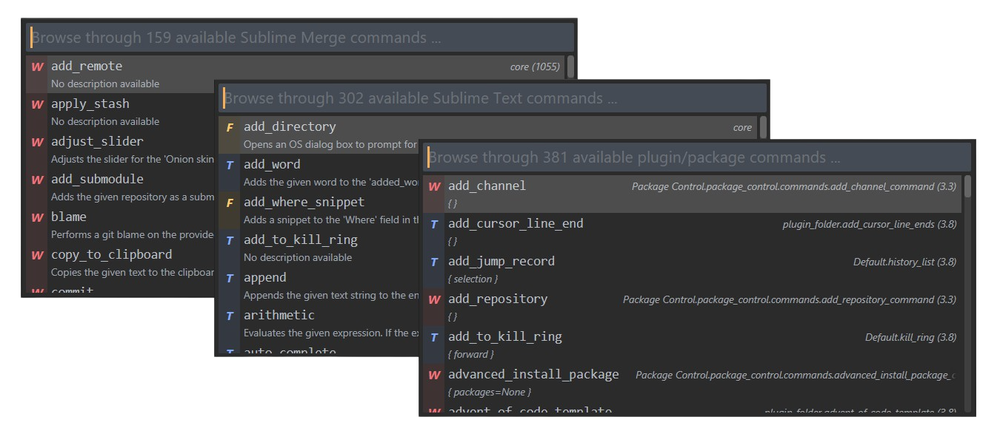

# CommandsBrowser

      

A Sublime Text package that allows a user to view all the available core/plugin commands for Sublime Text and Sublime Merge, along with their documentation/source.

## Installation

#### Package Control

There are several ways of installing & using this package, which are listed below (from the most preferred way to the least preferred way)

1. Use `Package Control: Install Package` and search for `CommandsBrowser` & install it.
2. Use `Package Control: Add Repository`. Copy the GitHub url for this repository (without the `.git` at the end) and enter it into the input panel that pops up at the bottom when you select `Package Control: Add Repository`. Now use `Package Control: Install Package` and search for `CommandsBrowser` and install it.
3. Simply `git clone` this repository in your `Packages` directory.
4. Whenever a new tagged release is pushed, grab the attached zip file for that release, rename it to remove the `.zip` extension & add `.sublime-package` extension and drop it into your `Installed Packages` directory (You however, loose the goodness of Package Control automatically updating the package, when there is a new tagged release).

If you are interested in contributing to this repository, then you need to follow (3). For more information, refer the [CONTRIBUTING](CONTRIBUTING.md) guidelines

## Documentation

### How to use this package ?

This package provides 3 items to the command palette.
1. `CommandsBrowser: Browse available ST core commands.`
This will show you all of the core commands that are present in Sublime Text. Selecting one would bring up a panel that would show the documentation for that command.
2. `CommandsBrowser: Browse available SM core commands.`
This will show you all of the core commands that are present in Sublime Merge. Selecting one would bring up a panel that would show the documentation for that command.
3. `CommandsBrowser: Browse available plugin/package commands.`
This will show you all of the plugin/package commands that are present in Sublime Text. Selecting one would open the corresponding plugin file & navigate to that location where the command class is implemented.

**Note:** Since the core command list is not exposed by ST like plugin commands are, the only way to keep track of it would be to manually maintain a list of commands and show it. So, the list is probably incomplete. As far as I know, it should be fairly close to a complete list (It's probably the most comprehensive public list available).

This package should be upto date with commands as of **ST Build 4122** & **SM Build 2062**

### Settings

##### `cb.auto_open_doc_panel_on_navigate` (`Boolean`)
When set to `true`, automatically opens the core commands documentation panel as you navigate through them. This can be helpful when you quickly want to glance the documentation for multiple commands at once and not have to close & reopen the panel every time.

The default value for this setting is `false`.

##### `cb.filter_plugin_commands_on_host` (`String`)
Sublime Text 4 has 2 plugin hosts. 3.3 (Python 3.3.6) & 3.8 (Python 3.8.8). This setting allows a user to filter the plugin commands based on the host.

Valid values are `"all"`, `"3.3"` and `"3.8"`
`"all"` - Show plugin commands from both hosts.
`"3.3"` - Show plugin commands from the 3.3 host only.
`"3.8"` - Show plugin commands from the 3.8 host only.

The default value for this setting is `"all"`.

##### `cb.filter_plugin_commands_on_type` (`List[str]`)
This setting allows a user to filter the plugin commands based on the type of the command.

Examples:
1. `["window", "application", "text"]` - Shows all command types.
2. `["window"]`                        - Filters to show only window commands.
3. `["application", "text"]`           - Filters to show only application & text commands.

The default value for this setting is `["window", "application", "text"]`.

##### `cb.filter_core_commands_on_type` (`List[str]`)

This setting allows a user to filter the core commands based on the type of the command.

Examples:
1. `["text", "window", "application", "find"]` - Shows all command types.
2. `["window", "find"]`                        - Filters to show only window & find commands.
3. `["application", "text"]`                   - Filters to show only application & text commands.

The default value for this setting is `["text", "window", "application", "find"]`.

### Key bindings.

This package just ships with one key binding to make it easier to open the core commands documentation panel. The key binding is <kbd>ctrl + shift + c, ctrl + shift + d</kbd>

### Discussions

[Discussions](https://github.com/Sublime-Instincts/CommandsBrowser/discussions) are enabled for this repo so that constructive discussions can be had on how to effectively use commands (especially core) to improve your ST/SM workflows. Any questions on core commands can be done in the respective channels i.e. [Sublime Text](https://github.com/Sublime-Instincts/CommandsBrowser/discussions/categories/sublime-text-commands) and [Sublime Merge](https://github.com/Sublime-Instincts/CommandsBrowser/discussions/categories/sublime-merge-commands).

Since plugin based commands are specific to plugin/package, it's best to ask them in the specific repository for that plugin/package. Of course, your free to ask relevant questions to get help.

## Contributing

See the [Contribution Guidelines](CONTRIBUTING.md) to understand how to contribute to this project !

## Acknowledgements

I'd like to make 2 acknowledgments here

1. [OdatNurd](https://github.com/OdatNurd/), who graciously granted me the permission to use his [plugin](https://gist.github.com/OdatNurd/fd6322a665c1730c7e16930b3a84999a) to make available all plugin/package provided commands. Most of that code remains untouched, but I have made a few tweaks here & there to suit the package.
He has an amazing [YouTube channel](https://www.youtube.com/c/OdatNurd) that you should definitely check out, if you are interested in using Sublime Text more efficiently.

2. [PackageDev](https://github.com/SublimeText/PackageDev), from where I got the intial list of [core commands metadata](https://github.com/SublimeText/PackageDev/blob/master/plugins/command_completions/builtin_commands_meta_data.yaml) to work on. `PackageDev` has a YAML file for storing the data, which did not suit my tastes for 2 reasons

(a) Python doesn't have a default module for working with YAML files, which is why `PackageDev` uses `pyyaml` as a dependency. At the time of writing this, Package Control doesn't allow dependencies within the 3.8 plugin host, so you are stuck on 3.3 (which I did not want to be).

(b) I did not want to add an unnecessary dependency to what may be a simple package like this one.

## License
The MIT License (MIT)

Copyright 2021 &copy; Ashwin Shenoy

Permission is hereby granted, free of charge, to any person obtaining a copy of this software and associated documentation files (the "Software"), to deal in the Software without restriction, including without limitation the rights to use, copy, modify, merge, publish, distribute, sub license, and/or sell copies of the Software, and to permit persons to whom the Software is furnished to do so, subject to the following conditions:

The above copyright notice and this permission notice shall be included in all copies or substantial portions of the Software.

THE SOFTWARE IS PROVIDED "AS IS", WITHOUT WARRANTY OF ANY KIND, EXPRESS OR IMPLIED, INCLUDING BUT NOT LIMITED TO THE WARRANTIES OF MERCHANTABILITY, FITNESS FOR A PARTICULAR PURPOSE AND NONINFRINGEMENT. IN NO EVENT SHALL THE AUTHORS OR COPYRIGHT HOLDERS BE LIABLE FOR ANY CLAIM, DAMAGES OR OTHER LIABILITY, WHETHER IN AN ACTION OF CONTRACT, TORT OR OTHERWISE, ARISING FROM, OUT OF OR IN CONNECTION WITH THE SOFTWARE OR THE USE OR OTHER DEALINGS IN THE SOFTWARE.
